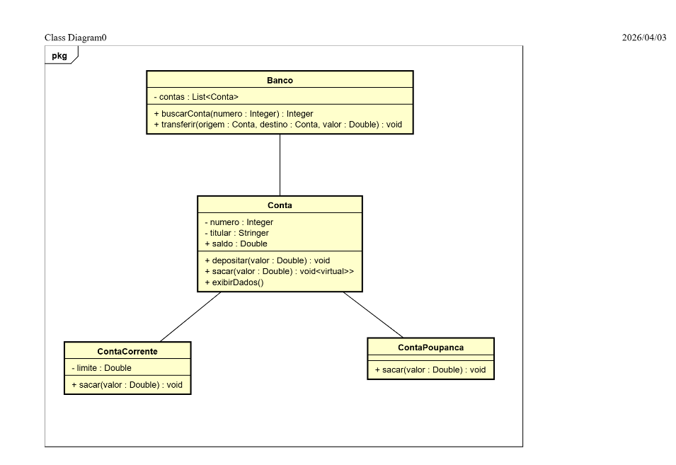

# 💰 Sistema Bancário em C# (POO)

Este projeto consiste em uma aplicação de console desenvolvida em C# com o objetivo de simular operações bancárias básicas, aplicando conceitos de Programação Orientada a Objetos (POO).

---

## 🚀 Funcionalidades

- Criar contas bancárias
- Depositar valores
- Realizar saques
- Transferir entre contas
- Listar contas cadastradas
- Remover contas
- Aplicar rendimento (conta poupança)

---

## 🧠 Conceitos aplicados

- Encapsulamento
- Herança
- Polimorfismo
- Tratamento de exceções
- Organização em camadas (Entities / Services)

---

## 🏗️ Estrutura do projeto

- `Entities` → classes principais do domínio (`Conta`, `ContaCorrente`, `ContaPoupanca`)
- `Services` → regras de negócio (`Banco`)
- `Program.cs` → interação com o usuário

---

## 🧩 Diagrama UML

<p align="center">
  
</p>

<p align="center">
  <em>Diagrama UML representando a estrutura orientada a objetos do sistema bancário, com aplicação de herança, encapsulamento e polimorfismo.</em>
</p>

---

## 💻 Tecnologias utilizadas

- C#
- .NET
- Programação Orientada a Objetos

---

## ⚙️ Como executar

```bash
git clone https://github.com/rafaelrodrigues-tech/sistema-bancario-poo.git
cd sistema-bancario-poo
dotnet run
